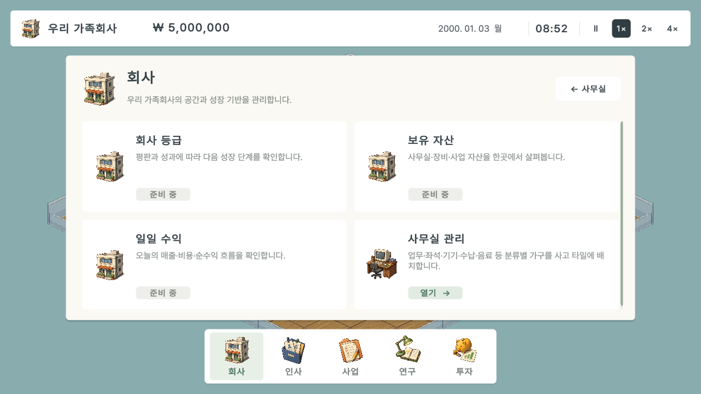
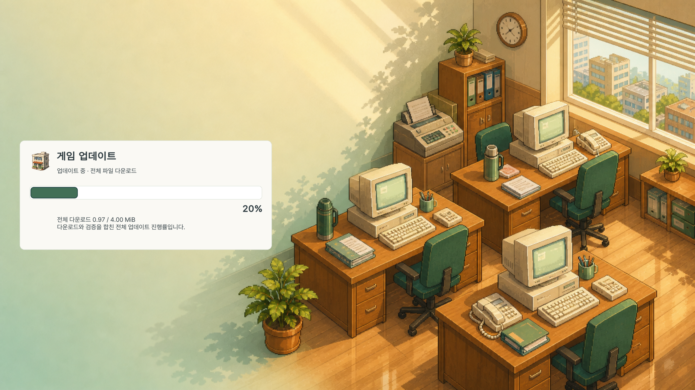
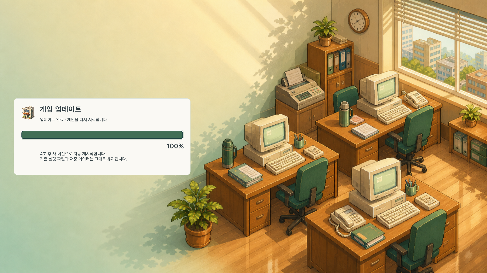

# Casual v6 release and fixed-main refresh — 2026-09-07

Delivered [fc-win-20260907.3](https://github.com/zzangzzangman2/company/releases/tag/fc-win-20260907.3),
sequence **6**, release **384067644**, game source **cb86605dad19a823551498c2d4bb6bd073031864**.
Later handoff/document/test-tool commits are not the game's build SHA. No subsequent game rebuild is implied.

## Delivered change

Shared paper-white/sage/Pretendard menus, responsive internal details, shop/market presentation and six generated
office icons. Existing characters, furniture geometry, Simulation/Save and shipping workers remain unchanged from v5.
One overall progress value: aggregate compressed download 0–85 → final hash verification 85–99 → accepted result 100.
These are stage weights, not an ETA. Folder/expand/reuse transitions never reset the value.
Actual loading Repaint begins the four-second restart notice, followed by normal parent exit and verified Unity child.

Other directly reviewed screens: personnel, products at 1024×768, research at 1600×1000, investment at 1920×1080,
current shop and market. Structured overflow/containment checks visited all internal routes at four resolutions.
Unimplemented cards remain labelled 준비 중. No false feature completion or placeholder live stock integration.

## Verification and scope

- Clean exact Unity 6000.3.21f1 non-Development Release: 83.01 seconds. `BUILD_INFO.txt` binds the source;
  `build-candidate.json` is the initial construction record with approval still pending, not the final verdict.
  `release-receipt.json` and its separate gate files hold the final evidence.
- Pure Simulation/save PASS. Initial broad Editor heap assertion failed once; two bounded repeats passed unchanged.
  Original failed result/log and both passing logs retained. No oracle/tolerance changes; exact initial cause unconfirmed.
- Final Release HUD: 1280×720, 1024×768, 1600×1000, 1920×1080; no observed TMP overflow/runtime exceptions.
  Navigation: 54 actual Unity EventSystem routes, not Windows native mouse clicks.
- Normal run: 8,100 navigation samples, collision/error samples zero, max rail deviation 0.0000256875 cells.
  Four next-day arrivals and real later seated work; 3,727 settled seat samples with zero failures.
- Controlled 8 seated directions/body combinations: 264 samples, no chair penetration, hand error within 0.015.
  These controlled poses are separate from the normal live seat/blend observation.
- 23.975-second actual walk: 337 frames; four midpoint/lead-alternation gates pass. All eight seat captures and
  chronological sheets 00/03/07/11/15/16 were directly reviewed. Not every frame, zero skin-slip or new model approval.
- Business: actual first lesson work, final development 4 PH and support 2 PH passed. Earlier history and billing
  are explicit checkpoints; not uninterrupted full-week native play.
- 81 fresh shipping-worker regression assertions and 18 display-model assertions.
- Earlier native shop purchases/rotation/overlap evidence binds only unchanged controller/grid/transaction code.
  Skin colors/font did change. Scale and complete style/layout-metrics tail are identical; current managed purchases,
  four rotations, rejection and renders were also exercised. `native-binding.json` explicitly limits the claim.

## Patch UI versus public transfer

`patch-ui-*` shows two-folder paced local streaming with exact Release executable/DLL bytes in an isolated
QA-named copy. That activates the existing diagnostic switch without changing the compiled game bytes.
`restart-*` additionally observes a real normal-named Unity successor and verified snapshot. Fixture workers are local,
not a GitHub transport test. The shipping payload remains byte-identical to the gameplay-tested Release.

The first test incorrectly passed fixture flags to a normal-named Release. Its `qa=False` boot checked public v5;
the screenshot gate rejected it. Main/cache-pointer/save contents remained unchanged, while updater run logs/locks
were touched. `failed-fixture-*` preserves this failure; it is not counted as PASS. Corrected copy-based tests passed.
Post-release QA entry guards now refuse normal-name invocation before process/fixture creation, avoiding recurrence.
This safety-tool change does not alter or rebuild the public game.

Headless entry-guard tests: four expected refusals in PS5.1/PS7, no game process or fixture directory created.
The first harness comparison missed the PS7 line-wrapped error text; its original refusal logs are retained in
`fixture-guard-parser-first-attempt`. Only log-display whitespace normalization was corrected before the four PASS
checks. No refusal condition or shipping code was relaxed. `fixture-entry-guards.json` records exact test-tool hashes.

Fresh **public GitHub** transfer uses the unchanged real shipping worker in an isolated v5 installation:

- 12 changed files, **166,189,664 compressed bytes**, 158 monotonic download events, 157 reused files.
- All 169 file hashes verified. PrepareOnly does not activate or start Unity.
- User main, v5 pointer/cache and 5 saves unchanged during this public test; before/after state hashes match.
- Fifteen GitHub uploaded assets were verified by numeric IDs, size and SHA256 before the draft became public.
- Full ZIP: 276,668,119 bytes; SHA256 `1f856cb9985adae3ad767d959a4ca76634998411058a951b89c6bc9f5ea6dc66`.

See `patch-public-delta.json`, `patch-public-worker.txt`, `published-inventory.json` and `release-receipt.json`.
This does not claim a new user-desktop main run or native OS click.
Fresh post-publication refs/tags/releases inventory: prohibited=0, unknown=0, complete pagination;
see `remote-after-publication.json`. It scanned the published game source/tag before the later documentation/tool push.

## Approved fixed-main migration

The user explicitly approved **메인도 백업 후 갱신**, because the old v2 bootstrap cannot change its own first
patch screen by merely launching a newer snapshot. After public verification, the whole 169-file old main was moved
to an exact validated backup first. The verified public ZIP was staged, hashed and installed at the same main path.
No files were deleted. Rollback handling preserves the old installation if replacement fails; it was not needed.

- Main: `C:\Users\godho\Downloads\FamilyCompany_Playtest\FamilyCompany.exe`.
- Backup: `C:\Users\godho\AppData\Local\FamilyCompany\InstallationBackups\20260907-212438-6fe36f2bde9343c0b9f2e6db9f47ea8c-before-fc-win-20260907.3\FamilyCompany_Playtest`.
- 169 new files match the public manifest. All 169 old files remain in the backup with original hashes.
- 5 saves/backups, 10 total files under the save directory and 344 patch-cache files remain unchanged.
- The main was not auto-launched. Cache v5 is preserved. Since the existing worker prefers current-cache files over
  seed files, the next actual home launch downloads the measured 12-file v5→v6 delta and activates v6. Later unchanged
  launches only verify. This is not a promise that every other PC has the same download size.

`main-refresh-before.json` and `main-refresh-result.json` record the exact paths and hashes. Company instructions:
[MAIN_GAME_ENTRY.md](../../MAIN_GAME_ENTRY.md). No cross-PC save sync, paid generation or shutdown was performed.

The one-time final graphics authorization is consumed. Future graphics/Player validation needs fresh approval.
These historical evidence files are not reusable fresh release approval. The former 166-file failing FastQA cache
was retired with its failure evidence preserved; no failed runtime payload was promoted. The earlier accumulated
PROJECT_STATE is preserved under `Docs/History/Reports`, while the current state is condensed for handoff.
