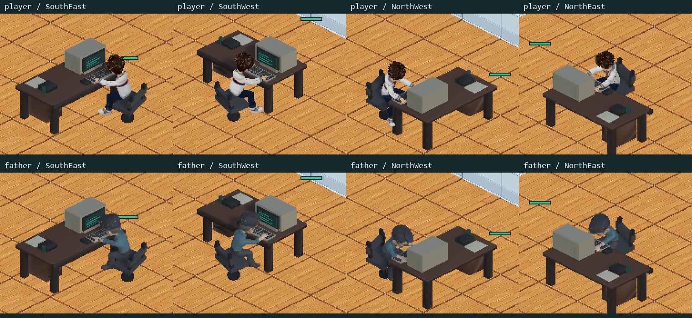

# Monitor/table alignment patch — verified release 2026-09-06

Published [fc-win-20260906.3](https://github.com/zzangzzangman2/company/releases/tag/fc-win-20260906.3),
source `4b06247ea2c4652fc320fa13c141f3501e3b5cae`, sequence 3, Release ID 383586367.
Exact Unity 6000.3.21f1 non-Development build, clean source main pushed before packaging.
Later documentation commits do not change or rename the published game build.

## User acceptance and scope

User approved the corrected sheet with **"1" / "이 모습으로 배포"** and then asked to continue.
The task changes only the CRT/keyboard axes and CRT face normals, plus the four desk preview PNGs.
Camera/body/chair/seat sockets/materials/dimensions/navigation/money/saves/updater were not changed.
The current Release captures for both real bodies in all four seat directions exactly match all eight
approved FastQA PNG hashes. The composed current sheet was visually inspected as well.

## Independent evidence

- `geometry.json`, `red-geometry.json`, `green-geometry.json`: actual mesh edge/normal/chair-centre checks,
  authoring + mapped runtime bases x four directions. Red CRT/keyboard edge error 19.4712 degrees and
  CRT face-normal error 77.0653; green axis <=0.028, face normal 0, chair/stem displacement 0. Original
  0.1-degree/0.0001-position tolerances retained; no relaxed gate.
- `content-binding.json`: exact game source inputs differ from v2 only in runtime Workstation, independent
  editor oracle and four preview PNGs. It records all 169 payload file hashes, 163 unchanged, and the six
  expected changed files. Shipping workers unchanged. This is **not whole binary equivalence**: the runtime
  assembly and Resources bundles intentionally differ. Approved eight current frame hashes are recorded.
- `native-binding.json`: original 8ce native purchase/rotation/overlap evidence is bound only to unchanged
  transaction/input/occupancy source, plus fresh current programmatic shop and geometry measurements.
  **No new native click** was issued. Old `maximumAxisDegrees` tested centrelines, not the bug's CRT width
  edge or face shading. Do not cite that old field as having covered the current symptom.
- `normal-runtime.json`: fresh exact Release normal routes/clock, 8,104 navigation samples, rail violations 0,
  max fraction error 0.0000256875. Four actors, collision/interaction/runtime errors 0. Normal settled work
  2,970 samples, failures 0, max individual hand error 0.008899. Next-day staggered arrivals/work passed.
  Mute output zero. Programmatic furniture setup and afternoon/night clock setup are explicitly retained;
  live work/navigation themselves use normal control. Private desktop, no input desktop switching.
- `seated-fit.json`, `chair-fit.csv`: separate controlled pose-injection fixture, 264 typing/seat samples,
  penetration 0, knee/hand gates passed. This does not replace normal seating observations.
- `walk-acceptance.json`, `walk-analysis.json`: fresh 414-frame natural walk, all four foot-centre/alternation
  gates pass. Existing user-approved multi-cycle motion is retained only for unchanged actor/clip/locomotion
  inputs. Foot-midpoint/ankle/periodic skin sampling does **not** establish mathematical zero skin slip;
  limitations remain verbatim in the analysis. No new animation/body creation is claimed.
- `updater-regressions.json`: fresh 81/81 — core 51, latest-only 6, restart helper 10, exact manifest block 7,
  draft lookup 7. Local fixture tests remain distinct from the public transfer below.
- `approval.json`, `release-receipt.json`, `BUILD_INFO.txt`: exact release identity, explicit approval,
  independent gates. Public receipt SHA-256
  `4762696df411582826697c52b9225a8e7521f92d66dcbd85722ff740d7c6749e`.

## Real public v2 -> v3 delta; user installation untouched

`patch-public-delta.json` and `patch-worker.txt` describe the actual unchanged shipping worker, public
GitHub latest/API/manifest/gzip downloads, using an **isolated QA install root** seeded from verified v2.
No mock server, fake worker or generation service was used.

- 6 changed files: **159,476,005 compressed bytes (152.1 MiB)**, 150 actual download events through 100%.
- 163 unchanged files reused; all 169 original sizes and SHA-256 values verified.
- Manifest SHA-256 `c8a152d8e88ec8037e6d635d60a8d7b6460317eaadf9beadf0adbef84c24b84d`.
- The worker correctly returns `prepared`; it does not activate until restart. QA current remains v2.
- Existing Downloads main: 169 verified files unchanged. User AppData current pointer and verified v2
  snapshot unchanged. Five saves/backups unchanged (`patch-before.json` / `patch-after.json`).
- **No Unity restart or new presented patch-screen test was performed in this v3 transfer run.** That
  unchanged production Unity path was tested in the [v2 evidence](../FirstPublicRelease20260906/README.md).
  The user specifically wants to open the existing main and see their real next download; preserve that.
- Actual internet-outage recovery was not exercised. Local fault fixtures are not presented as a real outage.

The changes are small, but Resources are packed into file-level bundles. This is not a model-level or
binary-block delta. Keep the v2 release assets referenced by the v3 manifest; do not delete dependencies.
New-PC full ZIP: 271,000,614 bytes, SHA-256
`c44257baffd4ad71d7bf3bc6cc42dd9ac34abdf48786ccf01e0c07fde4e79aa4`.
An already installed PC should **not** reinstall the ZIP or move its main EXE.

## Reproducibility / company handoff

`evidence-inventory.json` maps original artifact paths to the byte-identical files retained here.
Original receipt gate paths remain historical provenance, not new company-local artifact paths. Use
the retained filename/hash map after pulling at company. `receipt-builder.ps1` and `public-delta-runner.ps1`
are preserved exact-run provenance, **not instructions to rerun old home paths on a new machine**.
Raw observation/trace hashes are in the receipts; large frame/CSV caches stay in ignored local Artifacts.
Published release identity/assets are in `published-inventory.json`; fresh remote audit is `remote-inventory.json`.
The reviewed allowlist preserves v2 and adds v3 exact asset IDs, sizes, digests, and immutable receipt hash.
Evidence bytes are protected by `.gitattributes -text` across Windows checkouts.

Play: `%USERPROFILE%\Downloads\FamilyCompany_Playtest\FamilyCompany.exe` — no Unity, pull or build needed.
Develop: clean canonical `main`, `git pull --ff-only origin main`, read AGENTS/PROJECT_STATE and
[MAIN_GAME_ENTRY](../../MAIN_GAME_ENTRY.md). Home source is
`C:\Users\godho\Documents\Codex\fc_agents\integration_p0`; the old August workspace is not canonical.
