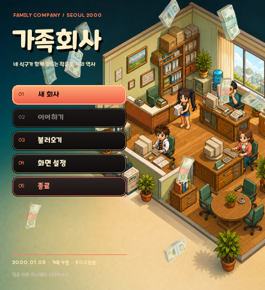

# 가족회사 (가제)

14살 플레이어가 엄마·아빠·누나와 2000년의 작은 사무실에서 시작해, 하청을 버티고 자체 사업을 세우며 실제 기업들과 경쟁하는 싱글플레이 생활 경영 RPG입니다.

<p align="center">
  
</p>

## 현재 플레이 가능한 기준선

- 새 게임은 `2000-01-03 08:50`, 가족 4명, 자본금 500만 원으로 시작합니다.
- 가족 4명만 `09:00`~`09:03`에 1분 간격으로 출근하고 `18:00`부터 퇴근합니다. 직원 8명은 시작 인원이 아니라 향후 채용 후보입니다.
- `MainNavigationV2`의 회사·인사·사업·연구·투자 5개 허브를 사용합니다. 회사 허브는 사무실 편집, 사업 허브는 계약/제품, 투자 허브는 주식으로 연결됩니다.
- 계약 고객은 `T0 → T1 → T2 → T3 → T4` 순차 해금과 등급 하락/회복 규칙을 가집니다.
- 사무실 편집기는 배치·회전·이동·회수·재고·저장을 지원합니다. 전체 저장 스키마는 `v8`이고 `v1`~`v7`을 읽어 이관합니다.
- 캐릭터 방향과 걷기 애니메이션은 요청 속도가 아니라 프레임의 실제 이동량으로 판정합니다.
- 기본 렌더는 `1920×1080`, native scale 1, pixel snap을 사용하고 작은 창은 compact UI로 대응합니다.
- 주식은 회사 자금과 연결되며 시장 시간, 7+7 호가, 가격·시간 우선 FIFO, 수수료·세금, 결정론적 저장 규칙을 유지합니다.

기능별 현재 통합 상태, 미완료 항목, 최신 검증은 [PROJECT_STATE.md](Docs/PROJECT_STATE.md)가 유일한 정본입니다.

## Windows에서 바로 실행하기

Unity `6000.3.21f1`이 설치된 저장소 루트에서 다음 명령을 사용합니다.

```powershell
.\BUILD_WINDOWS.cmd
.\RUN_WINDOWS.cmd
```

- 빌드 출력: `Builds/Windows/FamilyCompany_Playtest/FamilyCompany.exe`
- 빌드 출처: 같은 폴더의 `BUILD_INFO.txt`에서 commit SHA와 Unity 버전을 현재 `git rev-parse HEAD`와 비교합니다.
- `Builds/`는 Git에 포함되지 않습니다. 다른 PC에서는 pull 후 직접 빌드하거나 검증된 빌드 폴더 전체를 복사해야 합니다.
- 상세 절차와 오류 해결은 [PLAYTEST_BUILD.md](Docs/PLAYTEST_BUILD.md)를 따릅니다.

Editor에서 실행하려면 `Assets/FamilyCompany/Scenes/Prototype01.unity`를 열고 Play를 누릅니다.

## 문서 정본

| 순서·분야 | 문서 | 역할 |
| --- | --- | --- |
| 1 | [AGENTS.md](AGENTS.md) | 작업·검증·파일 소유권 규칙 |
| 2 | [PROJECT_STATE.md](Docs/PROJECT_STATE.md) | 현재 통합/대기/미완료와 최신 검증 |
| 3 | [CANON.md](Docs/CANON.md) | 가족·직원 후보·시각 콘텐츠 정본 |
| 4 | [DECISIONS.md](Docs/DECISIONS.md) | 구조와 방향 결정의 이유 |
| 구조 | [ARCHITECTURE.md](Docs/ARCHITECTURE.md) | 순수 시뮬레이션·저장·Unity 경계 |
| 사무실·UI | [ART_STYLE.md](Docs/ART_STYLE.md), [OFFICE_BUILD_EDITOR_V1.md](Docs/OFFICE_BUILD_EDITOR_V1.md), [MAIN_NAVIGATION_HUD_V2.md](Docs/MAIN_NAVIGATION_HUD_V2.md), [FRONTEND_V0_4.md](Docs/FRONTEND_V0_4.md) | 현재 런타임 시각·편집·내비게이션 |
| 계약 | [CONTRACTS_V0_3.md](Docs/CONTRACTS_V0_3.md), [CONTRACT_CLIENT_PROGRESSION_V1.md](Docs/CONTRACT_CLIENT_PROGRESSION_V1.md) | 계약 실행과 T0~T4 성장 |
| 주식 | [SIMUL_MARKET_PORT.md](Docs/SIMUL_MARKET_PORT.md), [STOCK_MARKET_LANDSCAPE_V1.md](Docs/STOCK_MARKET_LANDSCAPE_V1.md) | 시장 코어와 가로형 UI |
| 실제 회사 역사 | [CLAUDE_HANDOFF_HISTORY_DATA.md](Docs/CLAUDE_HANDOFF_HISTORY_DATA.md), [CLAUDE_HISTORY_PROGRESS.md](Docs/CLAUDE_HISTORY_PROGRESS.md) | History 전용 경로와 데이터 상태 |
| 다른 PC 재개 | [HOME_PC_CONTINUATION_GUIDE.md](Docs/HOME_PC_CONTINUATION_GUIDE.md) | pull·빌드·실행·검증 순서 |

`Docs/History/Reports/`의 문서는 당시 구현 증거를 보존한 역사 보고서이며 현재 상태를 덮어쓰지 않습니다.

## 개발 규칙 요약

- 정본 개발 브랜치는 `main` 하나이며, clean 상태에서만 `git pull --ff-only origin main`을 실행합니다.
- `Library`, `Temp`, `Logs`, `work`, `Builds`는 Git에 넣지 않고 `Assets`의 `.meta`는 반드시 추적합니다.
- 회사 PC에서는 Unity/EXE를 전면 실행하지 않습니다. 컴파일·순수 로직 검증은 백그라운드 batchmode, 실제 렌더 검증은 graphics가 활성화된 batchmode를 사용합니다.
- 제안서나 완료 보고서는 자동으로 정본이 아닙니다. 구현과 검증 후 `PROJECT_STATE.md`에 반영된 내용만 현재 상태입니다.

## 기본 자동화

- `Tools/BuildPrototype.ps1`: `Prototype01` 재생성
- `Tools/ValidatePrototype.ps1`: 시간·RNG·가족·회계·저장·에셋 검증
- `Tools/Build-FamilyCompanyWindows.ps1`: 독립 실행 Windows 플레이테스트 빌드
